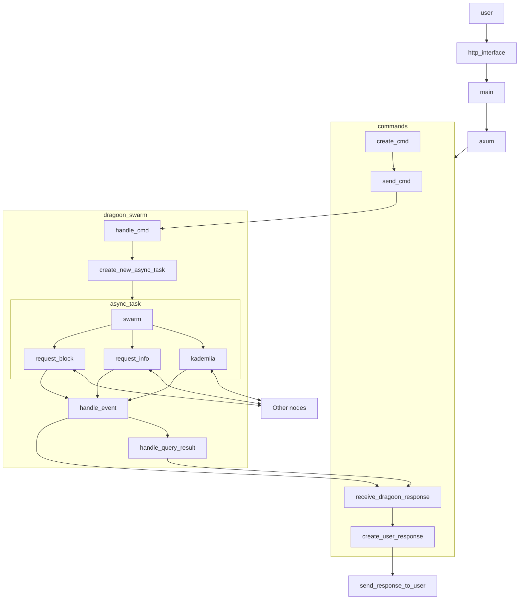

# Table of contents

- [Glossary](#glossary)
- [Structure](#structure)
    - [Inside a node](#inside-a-node)
    - [With other nodes](#with-other-nodes)
- [The http interface](#the-http-interface)
    - [Possible commands](#possible-commands)
    - [Our Command Line Interface](#our-command-line-interface)

# Glossary

- multi-address: abbreviated as multiaddr. Of the form `/ip4/192.168.33.210/tcp/31200`, it contains the ip on which a given node can be joined (`192.168.33.210`), the addressing (`ip4`), the protocol (`tcp`) and the port used for the protocol (`31200`). Some multiaddr can contain more protocol, and can also end with `/p2p/12D3KooWDpJ7As7BWAwRMfu1VU2WCqNjvq387JEYKDBj4kx6nXTN`, giving the peer id of the node.
- node: a process on a computer that can be part of the network
- node index: when creating multiple nodes with Nu, the nodes are indexed starting from 0
- node port: a port on which the node accepts an exchange (generally included in the multiaddr)
- peer: the owner of a node
- peer id: a unique reference to a peer of the network. This is a cryptographic hash. It is generally represented in string format in base 58, for example `12D3KooWDpJ7As7BWAwRMfu1VU2WCqNjvq387JEYKDBj4kx6nXTN`

# Structure

A network is made of **nodes**. Each node is its own entity, and can interact with other nodes of the network. Each node can receive commands on an http interface on a dedicated port (currently 127.0.0.1:(3000 + current node index), current node index is the number of the node, starting from 0. So 0 for the first spawned node, 1 for the 2nd...).

## Inside a node

### Data flow

The main entry point is in the `main`, with an `axum` router that redirects commands of the http interface to their related internal commands in the `commands` module. This module creates the internal commands and sends them to the `dragoon_swarm` module.
Those commands are catched by `handle_command` inside `dragoon_swarm`, which will then take the appropriate action depending on the input. See below for a more detailled graph explaining the flow of a user request.



Since everything is async, multiple requests can be sent by a user at the same time through the http interface, and each will spawn a new async task which will handle the required request.

### Data storage

Each node has a directory for itself inside `~/.share/dragoonfly`. The structure is as follows:

```
 .
├──  12D3KooWDpJ7As7BWAwRMfu1VU2WCqNjvq387JEYKDBj4kx6nXTN
│   └──  files
│       ├──  79c29b5bddd0ffa7af86cc4d8a46e9fb6a872faaaf96c3862799101c28bd135e
│       │   ├──  blocks
│       │   │   ├──  6d2ed57463e0c22ed621dea96ccb1edba11915523d787fd989dd03181765
│       │   │   ├──  ed638a4ac9d9e7204ec42a45874556e195b8c8db1e3ec21218e9cb70a07b9a89
│       │   │   ├──  eecd873c5c09341fcb614557a1b9ef24adedfba08b1f688aa4220f79ac951
│       │   │   └──  f4b5fc9c57bed5d3991db34daeab4766ba5c9deef03dbdb7b62ef74850d851b
│       │   └──  decoded_image.png
│       └──  send_block_list.txt
└──  12D3KooWPjceQrSwdWXPyLLeABRXmuqt69Rg3sBYbU1Nft9HyQ6X
    └──  files
        └──  send_block_list.txt
```

Each node's directory is named with its corresponding peer ID, It contains a `files` directory. Inside the files directory, each file (identified by its hash) has its own directory. The blocks are inside the `blocks` directory, identified by their hash. Any decoded file will be put inside the directory of the file (next to the `blocks` directory`).

## With other nodes

- Kademlia: handles searches in the network, based on the XOR metric
- Request Info: peer to peer information exchange about the blocks that a given node provides for a given file
- Request Block: peer to peer block exchange

# The http interface

You can interact with the nodes by sending an http GET request on the local address of the node (with the correct port, i.e. 3000 + current node index). For more information about the exact way to interact with the API, see [our API.md documentation]((./API.md)). You are free to use any tool you want (Postman, curl, wget, etc.) to format the http requests and call the API. In addition, we have built our own [Command Line Interface](#our-command-line-interface) that allows you to call the API from a `nu` shell.

## Possible commands

- [Listen](./API.md/#listen-get)
- [Dial single](./API.md/#dial-single-post)
- [Dial multiple](./API.md/#dial-multiple-post)
- [Encode file](./API.md/#encode-file-post)
- [Start provide](./API.md/#start-provide-post)
- [Stop provide](./API.md/#stop-provide-post)
- [Get providers](./API.md/#get-providers-post)
- [Get blocks info from](./API.md/#get-blocks-info-from-get)
- [Get block list](./API.md/#get-block-list-get)
- [Get block from](./API.md/#get-block-from-get)
- [Decode blocks](./API.md/#decode-blocks-post)
- [Get file](./API.md/#get-file-get)
- [Node info](./API.md/#node-info-get)
- [Get connected peers](./API.md/#get-connected-peers-get)
- [Send block to](./API.md/#send-block-to-post)
- [Send block list](./API.md/#send-block-list-post)
- [Get available send storage](./API.md/#get-available-send-storage-get)
- [Change available send storage](./API.md/#change-available-send-storage-post)


## Our Command Line Interface

Our CLI uses Nu/Nushell. You need to have it installed to use it. 

In `swarm.nu`, the commands are used to create nodes (locally). A user will generally want to spawn only one, but for testing we might want to spawn several of them. Use `use cli/swarm.nu *; swarm run (swarm create X)` (with *X* the number of nodes you want to launch) to start using nodes. This will launch a new prompt for you where you can enter commands using `dragoon <command-name>`.

In `dragoon.nu` is where the "user" commands are written. All commands have a `--node` parameter to say on which of our node we want to send the command to (defaults to the first node, so a user with a single node does not need it).  Use `help app` to get a list of commands, `help <command-name>` to get more information about the parameters of a given command.
Use `swarm kill $SWARM` when you want to kill all the nodes you spawned.

In `network_builder.nu`, there is a tool to quickly create network topologies. It spawns several nodes and makes the required dial. It's mainly used for testing.

## Tests

The tests can be run with `make test`, by being at the root of the repository

Tests with ssh can be run with `make test ssh_addr_file="YOUR_SSH_ADDR_FILE"`. The name of your file should be inside doubles quotes.
